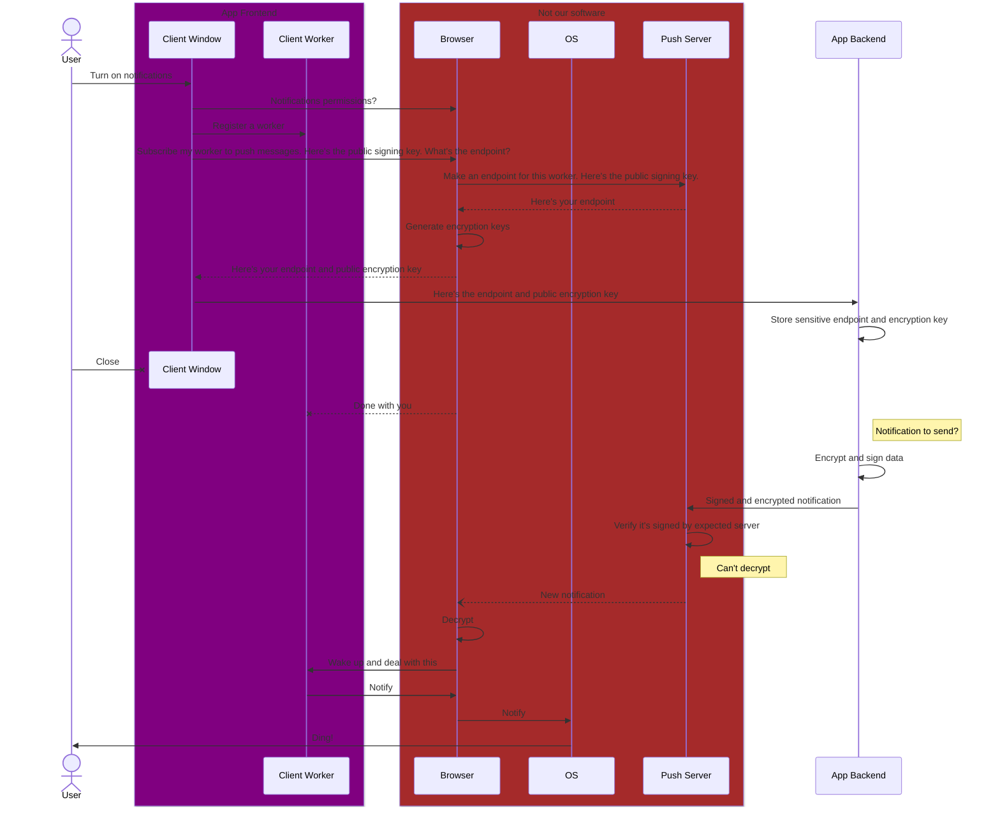

# Local running

## Setup

1. Install dependencies

   ```shell
   npm install
   ```

1. Run migrations locally

   ```shell
   npm run db:migrate:local
   ```

1. [Create then store new encryption keys](#creating-keys)

## Web worker (Pages Function):

1. Start the server

   ```shell
   npm run run:web
   ```

1. Browse to localhost:8787

## Notifier worker (cron worker):

1. Start the notifier

   ```shell
   npm run run:notifier
   ```

1. Simulate cron run:

   ```shell
   curl -X GET localhost:8788/__scheduled
   ```

# Deploying

1. Create the database

   ```shell
   npm run db:create:remote
   ```

1. Migrate the database

   ```shell
   npm run db:migrate:remote
   ```

1. [Create then store new encryption keys](#creating-keys)

1. Deploy web

   ```shell
   npm run deploy:web
   ```

1. Deploy notifier

   ```shell
   npm run deploy:notifier
   ```

# Creating keys

Keys are required for end-to-end encryption via the Web Push API. They need to generated in VAPID format. The easiest way to do this is with the web-push library. It's not needed at runtime but is an easy-to-use tool.

```shell
npm install --global web-push
```

Once installed, generate keys with the following command:

```shell
web-push generate-vapid-keys --json
```

1. The private key needs to be provided as a secret to the notifier:
   - For local running, Enter it into `src/notifier/.dev.vars`: `PUSH_SERVER_PRIVATE_KEY=...`
   - For deployment, execute `npx wrangler -c src/notifier/wrangler.toml secret put PUSH_SERVER_PRIVATE_KEY` then provide the value when prompted
1. The public key needs to be provided to the notifier and the frontend:
   - For the notifier, enter it in the vars section of `src/notifier/wrangler.toml`
   - For the frontend, provide it as the `SERVER_PUBLIC_KEY` in `src/web/key.js`

# Web Push API - A diagram


